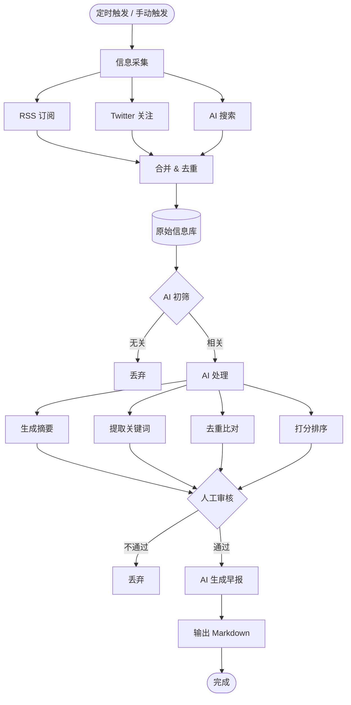
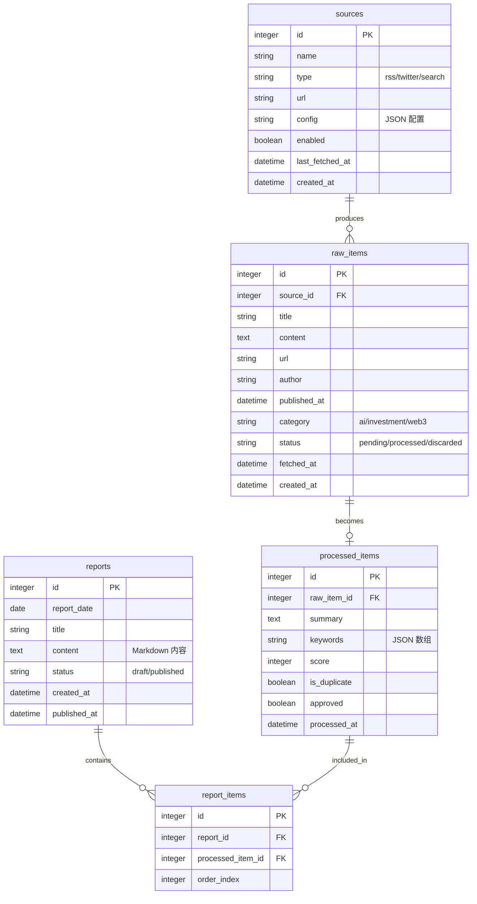

# AI Daily News Bot - 架构设计文档

## 项目概述

自动采集 AI + 投资 + Web3 领域信息，通过 AI 筛选处理，生成每日早报（Markdown 格式）。

---

## 技术栈

| 层级 | 技术选型 |
|-----|---------|
| 后端 | Python 3.11+ / FastAPI |
| 定时任务 | APScheduler / 系统 crontab |
| 数据库 | SQLite（开发）/ PostgreSQL（生产可选） |
| RSS 解析 | feedparser |
| Twitter 采集 | RSSHub / Apify |
| AI 搜索 | Tavily API / Exa API |
| LLM | Qwen3 / GLM-4 / GPT-4o（根据成本选择） |
| 前端（可选） | Next.js + Tailwind CSS（管理界面） |

---

## 1. 系统架构图

```
┌─────────────────────────────────────────────────────────────────────────┐
│                           AI Daily News Bot                              │
└─────────────────────────────────────────────────────────────────────────┘

                              ┌───────────────┐
                              │   定时调度器   │
                              │    (Cron)     │
                              │  每 2-4 小时   │
                              └───────┬───────┘
                                      │
          ┌───────────────────────────┼───────────────────────────┐
          │                           │                           │
          ▼                           ▼                           ▼
┌─────────────────────┐   ┌─────────────────────┐   ┌─────────────────────┐
│                     │   │                     │   │                     │
│   采集源 A: RSS     │   │  采集源 B: Twitter  │   │  采集源 C: AI搜索   │
│                     │   │                     │   │                     │
│  • 官方博客         │   │  • 用户关注列表     │   │  • Tavily API       │
│  • 技术社区         │   │  • RSSHub 抓取      │   │  • 关键词搜索       │
│  • 投资媒体         │   │                     │   │                     │
│  • Web3 媒体        │   │                     │   │                     │
│                     │   │                     │   │                     │
└──────────┬──────────┘   └──────────┬──────────┘   └──────────┬──────────┘
           │                         │                         │
           └─────────────────────────┼─────────────────────────┘
                                     │
                                     ▼
                          ┌─────────────────────┐
                          │                     │
                          │    去重 & 标准化    │
                          │                     │
                          │  • URL 去重         │
                          │  • 标题相似度去重   │
                          │  • 统一数据格式     │
                          │                     │
                          └──────────┬──────────┘
                                     │
                                     ▼
                          ┌─────────────────────┐
                          │                     │
                          │     原始信息库      │
                          │     (raw_items)     │
                          │                     │
                          └──────────┬──────────┘
                                     │
                                     ▼
                          ┌─────────────────────┐
                          │                     │
                          │     AI 筛选处理     │
                          │                     │
                          │  • 初筛（相关性）   │
                          │  • 生成摘要         │
                          │  • 提取关键词       │
                          │  • 去重比对         │
                          │  • 打分排序         │
                          │                     │
                          └──────────┬──────────┘
                                     │
                                     ▼
                          ┌─────────────────────┐
                          │                     │
                          │     人工审核        │
                          │   (可选 Web 界面)   │
                          │                     │
                          └──────────┬──────────┘
                                     │
                                     ▼
                          ┌─────────────────────┐
                          │                     │
                          │    AI 生成早报      │
                          │                     │
                          │  • 生成标题         │
                          │  • 生成正文         │
                          │  • Markdown 排版    │
                          │                     │
                          └──────────┬──────────┘
                                     │
                                     ▼
                          ┌─────────────────────┐
                          │                     │
                          │    输出早报文件     │
                          │   (Markdown / DB)   │
                          │                     │
                          └─────────────────────┘
```

---

## 2. 核心业务流程



---

## 3. 数据模型

### 3.1 ER 图



### 3.2 表结构详细设计

#### sources（信息源配置）
```sql
CREATE TABLE sources (
    id INTEGER PRIMARY KEY AUTOINCREMENT,
    name TEXT NOT NULL,
    type TEXT NOT NULL CHECK(type IN ('rss', 'twitter', 'search')),
    url TEXT,
    config TEXT,  -- JSON 格式的额外配置
    enabled BOOLEAN DEFAULT TRUE,
    last_fetched_at DATETIME,
    created_at DATETIME DEFAULT CURRENT_TIMESTAMP
);
```

#### raw_items（原始信息）
```sql
CREATE TABLE raw_items (
    id INTEGER PRIMARY KEY AUTOINCREMENT,
    source_id INTEGER REFERENCES sources(id),
    title TEXT NOT NULL,
    content TEXT,
    url TEXT UNIQUE,  -- URL 去重
    author TEXT,
    published_at DATETIME,
    category TEXT CHECK(category IN ('ai', 'investment', 'web3', 'mixed')),
    status TEXT DEFAULT 'pending' CHECK(status IN ('pending', 'processed', 'discarded')),
    fetched_at DATETIME DEFAULT CURRENT_TIMESTAMP,
    created_at DATETIME DEFAULT CURRENT_TIMESTAMP
);

CREATE INDEX idx_raw_items_status ON raw_items(status);
CREATE INDEX idx_raw_items_fetched_at ON raw_items(fetched_at);
```

#### processed_items（处理后信息）
```sql
CREATE TABLE processed_items (
    id INTEGER PRIMARY KEY AUTOINCREMENT,
    raw_item_id INTEGER REFERENCES raw_items(id),
    summary TEXT,
    keywords TEXT,  -- JSON 数组格式
    score INTEGER DEFAULT 0,
    is_duplicate BOOLEAN DEFAULT FALSE,
    approved BOOLEAN DEFAULT FALSE,
    processed_at DATETIME DEFAULT CURRENT_TIMESTAMP
);

CREATE INDEX idx_processed_items_score ON processed_items(score DESC);
CREATE INDEX idx_processed_items_approved ON processed_items(approved);
```

#### reports（早报）
```sql
CREATE TABLE reports (
    id INTEGER PRIMARY KEY AUTOINCREMENT,
    report_date DATE NOT NULL UNIQUE,
    title TEXT,
    content TEXT,  -- Markdown 格式
    status TEXT DEFAULT 'draft' CHECK(status IN ('draft', 'published')),
    created_at DATETIME DEFAULT CURRENT_TIMESTAMP,
    published_at DATETIME
);

CREATE INDEX idx_reports_date ON reports(report_date);
```

#### report_items（早报内容关联）
```sql
CREATE TABLE report_items (
    id INTEGER PRIMARY KEY AUTOINCREMENT,
    report_id INTEGER REFERENCES reports(id),
    processed_item_id INTEGER REFERENCES processed_items(id),
    order_index INTEGER DEFAULT 0
);
```

---

## 4. 信息源配置

### 4.1 RSS 源（优先级最高）

| 类别 | 名称 | RSS URL |
|------|------|---------|
| AI 官方 | OpenAI Blog | https://openai.com/blog/rss.xml |
| AI 官方 | Anthropic Blog | https://www.anthropic.com/news/rss |
| AI 官方 | Google AI Blog | https://blog.google/technology/ai/rss/ |
| AI 官方 | Hugging Face Blog | https://huggingface.co/blog/feed.xml |
| AI 社区 | Hacker News AI | https://hnrss.org/newest?q=AI&points>50 |
| AI 社区 | r/MachineLearning | https://www.reddit.com/r/MachineLearning/new/.rss |
| 投资 | a16z Blog | https://a16z.com/feed/ |
| 投资 | TechCrunch | https://techcrunch.com/feed/ |
| 投资 | VentureBeat AI | https://venturebeat.com/category/ai/feed/ |
| Web3 | The Block | https://www.theblock.co/rss.xml |
| Web3 | Bankless | https://bankless.substack.com/feed |
| Web3 | Week in Ethereum | https://weekinethereumnews.com/feed/ |

### 4.2 Twitter 源

使用 RSSHub 将用户关注列表转为 RSS：

```
RSSHub 配置:
- 实例: https://rsshub.app (公共) 或自建
- 端点: /twitter/user/{username}
- 或使用 Apify Twitter Scraper (付费稳定)
```

### 4.3 AI 搜索源

```
Tavily API:
- 端点: https://api.tavily.com/search
- 关键词:
  - "AI news today"
  - "artificial intelligence breakthrough"
  - "Web3 news"
  - "crypto news"
  - "VC funding AI"
  - "LLM news"
```

---

## 5. 模块设计

### 5.1 项目结构

```
ai-daily-news-bot/
├── app/
│   ├── __init__.py
│   ├── main.py              # FastAPI 入口
│   ├── config.py            # 配置管理
│   ├── database.py          # 数据库连接
│   │
│   ├── collectors/          # 采集模块
│   │   ├── __init__.py
│   │   ├── base.py          # 采集器基类
│   │   ├── rss_collector.py
│   │   ├── twitter_collector.py
│   │   └── search_collector.py
│   │
│   ├── processors/          # 处理模块
│   │   ├── __init__.py
│   │   ├── deduplicator.py  # 去重
│   │   ├── filter.py        # AI 初筛
│   │   ├── summarizer.py    # 生成摘要
│   │   ├── classifier.py    # 关键词提取/分类
│   │   └── scorer.py        # 打分
│   │
│   ├── generators/          # 生成模块
│   │   ├── __init__.py
│   │   └── report_generator.py
│   │
│   ├── llm/                 # LLM 调用
│   │   ├── __init__.py
│   │   ├── base.py
│   │   └── prompts.py       # Prompt 模板
│   │
│   ├── models/              # 数据模型
│   │   ├── __init__.py
│   │   └── schemas.py
│   │
│   └── api/                 # API 路由（可选）
│       ├── __init__.py
│       └── routes.py
│
├── scripts/
│   ├── run_collector.py     # 手动运行采集
│   ├── run_processor.py     # 手动运行处理
│   └── run_generator.py     # 手动生成早报
│
├── data/
│   └── news.db              # SQLite 数据库
│
├── output/                  # 早报输出目录
│   └── reports/
│
├── tests/
│
├── requirements.txt
├── .env.example
└── README.md
```

### 5.2 核心模块说明

#### 采集器 (Collectors)

```python
# base.py
class BaseCollector:
    async def collect(self) -> List[RawItem]:
        raise NotImplementedError

# rss_collector.py
class RSSCollector(BaseCollector):
    async def collect(self) -> List[RawItem]:
        # 使用 feedparser 解析 RSS
        pass

# twitter_collector.py
class TwitterCollector(BaseCollector):
    async def collect(self) -> List[RawItem]:
        # 通过 RSSHub 或 Apify 获取 Twitter
        pass

# search_collector.py
class SearchCollector(BaseCollector):
    async def collect(self) -> List[RawItem]:
        # 调用 Tavily/Exa API 搜索
        pass
```

#### 处理器 (Processors)

```python
# filter.py
class AIFilter:
    async def is_relevant(self, item: RawItem) -> bool:
        """判断是否与 AI/投资/Web3 相关"""
        pass

# summarizer.py
class Summarizer:
    async def summarize(self, item: RawItem) -> str:
        """生成摘要"""
        pass

# classifier.py
class Classifier:
    async def extract_keywords(self, item: RawItem) -> List[str]:
        """提取关键词"""
        pass

# scorer.py
class Scorer:
    async def score(self, item: RawItem) -> int:
        """打分 (0-100)"""
        pass
```

#### 早报生成器 (Generator)

```python
# report_generator.py
class ReportGenerator:
    async def generate(self, items: List[ProcessedItem], date: date) -> str:
        """生成 Markdown 格式早报"""
        pass
```

---

## 6. LLM Prompt 模板

### 6.1 初筛 Prompt

```
你是一个新闻筛选助手。判断以下内容是否值得报道。

判断标准：
1. 与 AI、机器学习、LLM、投资、Web3、加密货币相关
2. 具有新闻价值（新产品、重大更新、融资、政策变化等）
3. 不是纯教程、使用体验、营销软文

标题: {title}
内容: {content}

请只回答 YES 或 NO。
```

### 6.2 摘要生成 Prompt

```
请为以下新闻生成一句话摘要（不超过100字）：

标题: {title}
内容: {content}

摘要：
```

### 6.3 关键词提取 Prompt

```
请从以下新闻中提取 3-5 个关键词：

标题: {title}
内容: {content}

请以 JSON 数组格式返回关键词，例如：["OpenAI", "GPT-5", "发布"]
```

### 6.4 打分 Prompt

```
请为以下新闻打分（0-100分），考虑以下因素：
- 重要性：是否影响行业
- 时效性：是否最新消息
- 独特性：是否独家报道
- 相关性：与 AI/投资/Web3 的关联程度

标题: {title}
内容: {content}

请只返回一个 0-100 的整数分数。
```

### 6.5 早报生成 Prompt

```
你是一个科技新闻编辑，请根据以下信息生成今日早报。

要求：
1. 按分类组织内容（AI技术 / AI投资 / Web3）
2. 每条新闻包含：标题、摘要、来源链接
3. 使用 Markdown 格式
4. 添加适当的标题和目录
5. 语言简洁专业

待报道的新闻：
{items}

请生成早报：
```

---

## 7. 定时任务配置

### 7.1 Cron 配置示例

```bash
# 每 2 小时采集一次
0 */2 * * * cd /path/to/ai-daily-news-bot && python scripts/run_collector.py

# 每天早上 6 点处理并生成早报
0 6 * * * cd /path/to/ai-daily-news-bot && python scripts/run_processor.py && python scripts/run_generator.py
```

### 7.2 APScheduler 配置（代码内）

```python
from apscheduler.schedulers.asyncio import AsyncIOScheduler

scheduler = AsyncIOScheduler()

# 每 2 小时采集
scheduler.add_job(run_collectors, 'interval', hours=2)

# 每天 6:00 生成早报
scheduler.add_job(generate_daily_report, 'cron', hour=6, minute=0)

scheduler.start()
```

---

## 8. API 设计（可选 Web 界面）

| 方法 | 路径 | 描述 |
|-----|------|-----|
| GET | /api/items | 获取待处理信息列表 |
| PATCH | /api/items/:id | 更新信息状态（审核） |
| POST | /api/items/:id/approve | 批准信息 |
| POST | /api/items/:id/reject | 拒绝信息 |
| GET | /api/reports | 获取早报列表 |
| GET | /api/reports/:date | 获取指定日期早报 |
| POST | /api/reports/generate | 手动生成早报 |
| GET | /api/sources | 获取信息源列表 |
| POST | /api/sources | 添加信息源 |
| POST | /api/collect | 手动触发采集 |

---

## 9. 环境变量

```env
# 数据库
DATABASE_URL=sqlite:///./data/news.db

# LLM API (选择一个)
# OpenAI
OPENAI_API_KEY=your_openai_api_key
OPENAI_BASE_URL=https://api.openai.com/v1  # 或代理地址
OPENAI_MODEL=gpt-4o

# 或 智谱 AI
ZHIPU_API_KEY=your_zhipu_api_key
ZHIPU_MODEL=glm-4

# 或 通义千问
DASHSCOPE_API_KEY=your_dashscope_api_key
QWEN_MODEL=qwen-max

# Tavily (AI 搜索)
TAVILY_API_KEY=your_tavily_api_key

# RSSHub (Twitter 采集)
RSSHUB_BASE_URL=https://rsshub.app
# 或自建地址

# Apify (可选，付费 Twitter 采集)
APIFY_API_TOKEN=your_apify_token
```

---

## 10. 输出示例

```markdown
# AI Daily News - 2024-01-15

## 目录

- [AI 技术](#ai-技术)
- [AI 投资](#ai-投资)
- [Web3](#web3)

---

## AI 技术

### OpenAI 发布 GPT-5 预览版

OpenAI 今日宣布推出 GPT-5 预览版，性能相比 GPT-4 提升显著...

[来源](https://openai.com/blog/gpt-5)

### Anthropic Claude 3.5 更新

Anthropic 发布 Claude 3.5 更新，新增多模态能力...

[来源](https://anthropic.com/news/claude-3.5)

---

## AI 投资

### xAI 完成 60 亿美元融资

马斯克旗下 xAI 完成 60 亿美元 B 轮融资...

[来源](https://techcrunch.com/xai-funding)

---

## Web3

### 以太坊 Dencun 升级定于 3 月

以太坊基金会宣布 Dencun 升级将于 3 月 13 日进行...

[来源](https://blog.ethereum.org/dencun)

---

*生成时间: 2024-01-15 06:00:00*
*信息来源: RSS + Twitter + AI Search*
```

---

## 11. 后续扩展

- [ ] Web 管理界面
- [ ] 邮件/微信推送
- [ ] 多语言支持
- [ ] 周报/月报生成
- [ ] RSS 订阅输出
- [ ] API 开放接口
